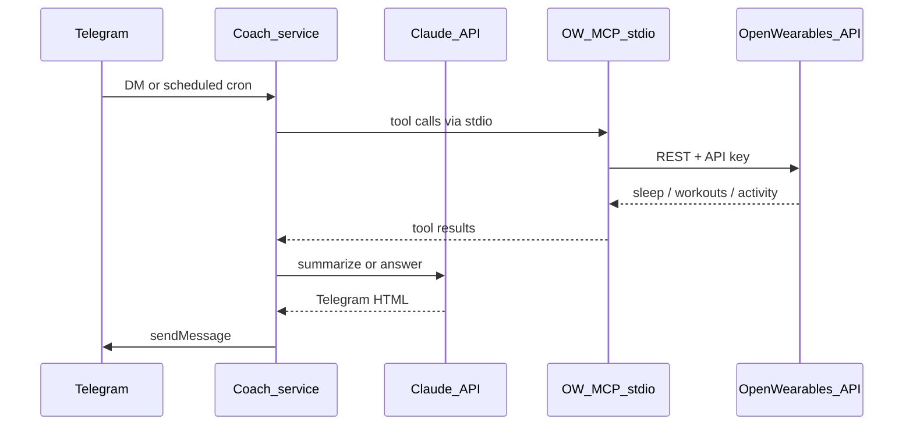

The **coach** service (`coach/` in this repository) is a single-user Telegram health agent. It sends a scheduled morning briefing and answers follow-up questions about sleep, workouts, activity, and related metrics from your Open Wearables data.

<Note>
  This is **not** the [Claude Managed Agents](/mcp-server/managed-agents-remote) API. Managed Agents talk to a **remote HTTPS MCP** with vault Bearer auth. The coach talks to Telegram itself and spawns the MCP server over **stdio** next to your backend.
</Note>

## What you get

- Daily briefing at `BRIEFING_TIME` in `BRIEFING_TIMEZONE`
- Inbound DMs: `/brief`, `/help`, `/clear`, or a natural-language question
- Only `TELEGRAM_CHAT_ID` is answered; other chats are ignored
- Long-polling (`getUpdates`) — no public webhook URL
- Startup `getMe` check so a bad bot token fails immediately
- Recent multi-turn memory (last 20 messages)

## Architecture



## Setup

Follow the full steps in the [coach README](https://github.com/CalvinKorver/open-wearables/blob/main/coach/README.md). Required env vars:

| Variable | Purpose |
|----------|---------|
| `OPEN_WEARABLES_API_URL` | Backend base URL |
| `OPEN_WEARABLES_API_KEY` | API key for the user being coached |
| `OW_USER_ID` | That user's UUID |
| `ANTHROPIC_API_KEY` | Claude API key |
| `TELEGRAM_BOT_TOKEN` | Token from [@BotFather](https://t.me/BotFather) |
| `TELEGRAM_CHAT_ID` | Numeric chat id of the allowed DM |

```bash
# from the repo root
cp coach/config/.env.example coach/config/.env
docker compose up -d coach
docker compose logs -f coach
```

Expect a log line `Telegram bot connected username=...` then chat with the bot.

## Chat commands

| Command | Effect |
|---------|--------|
| `/help` or `/start` | List commands |
| `/brief` | Send yesterday's briefing now (re-sends even if already delivered) |
| `/clear` | Drop stored conversation turns |
| free text | Answer using sleep, workout, activity, and timeseries MCP tools |

## Related

- [Coach README](https://github.com/CalvinKorver/open-wearables/blob/main/coach/README.md)
- [Managed Agents (HTTPS MCP)](/mcp-server/managed-agents-remote)
- [Health Data MCP Server](/mcp-server)
