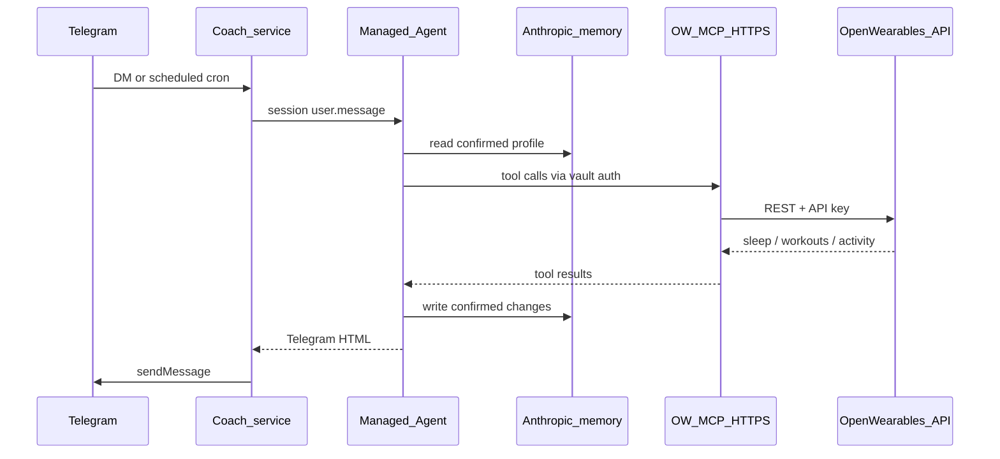

The **coach** service (`coach/` in this repository) is a single-user Telegram training agent. It sends a scheduled briefing, answers questions about Open Wearables data, and remembers confirmed race goals, injuries, and preferences.

<Note>
  The relay keeps no local transcript. Chat events and the athlete profile live in Claude Managed Agents. SQLite stores only Telegram offsets, briefing delivery state, and the active session ID.
</Note>

## What you get

- Daily briefing at `BRIEFING_TIME` in `BRIEFING_TIMEZONE`
- Inbound DMs: `/brief`, `/memory`, `/forget`, `/clear`, or a natural-language question
- Only `TELEGRAM_CHAT_ID` is answered; other chats are ignored
- Long-polling (`getUpdates`) — no public webhook URL
- Startup `getMe` check so a bad bot token fails immediately
- Full multi-turn session history and durable confirmed memory in Anthropic

## Architecture



## Setup

Configure the [Managed Agent and remote MCP](/mcp-server/managed-agents-remote), including a dedicated native memory store. Then follow the [coach README](https://github.com/CalvinKorver/open-wearables/blob/main/coach/README.md). Required env vars:

| Variable | Purpose |
|----------|---------|
| `OW_USER_ID` | That user's UUID |
| `ANTHROPIC_API_KEY` | Claude API key |
| `MANAGED_AGENT_ID` | Reusable agent definition |
| `MANAGED_ENVIRONMENT_ID` | Session environment |
| `MANAGED_VAULT_IDS` | Comma-separated vault IDs for remote MCP credentials |
| `MANAGED_MEMORY_STORE_ID` | Dedicated native memory store for this athlete |
| `TELEGRAM_BOT_TOKEN` | Token from [@BotFather](https://t.me/BotFather) |
| `TELEGRAM_CHAT_ID` | Numeric chat id of the allowed DM |

```bash
# from the repo root
cp coach/config/.env.example coach/config/.env
docker compose up -d coach
docker compose logs -f coach
```

Expect a log line `Telegram bot connected username=...` then chat with the bot.

## Chat commands

| Command | Effect |
|---------|--------|
| `/help` or `/start` | List commands |
| `/brief` | Send yesterday's briefing now (re-sends even if already delivered) |
| `/memory` | Show active goals, injuries/constraints, and preferences |
| `/forget <description>` | Remove a matching durable memory after confirmation when needed |
| `/clear` | Archive the session and start fresh while retaining durable memory |
| `/forget all` | Begin explicit deletion of live memory and coach sessions |
| free text | Answer using sleep, workout, activity, and timeseries MCP tools |

## Memory behavior

The coach uses a compact structured profile rather than embedding chat transcripts:

- Explicit non-sensitive requests such as “remember I prefer kilometres” are saved and echoed with an undo option.
- Inferred facts, conflicts, and all injury or medical information require confirmation before writing.
- Temporary restrictions remain active until the user confirms otherwise; the coach never infers diagnosis or recovery.
- `/clear` archives conversation context but keeps the profile. `/forget` changes the profile; `/forget all confirm` removes all live profile records and matching coach sessions.

This is the “hot profile” pattern described in [Atlan’s agent memory architecture overview](https://atlan.com/know/agent-memory-architectures/), implemented with [Anthropic native agent memory](https://platform.claude.com/docs/en/managed-agents/memory). Exact structured facts are small enough to read deterministically, so no vector database is needed.

<Warning>
  Use a private Telegram chat for health information. Anthropic memory versions can remain for the provider’s documented retention window after a live memory is deleted; deleting the entire store is required to remove the store and all versions.
</Warning>

## Related

- [Coach README](https://github.com/CalvinKorver/open-wearables/blob/main/coach/README.md)
- [Managed Agents (HTTPS MCP)](/mcp-server/managed-agents-remote)
- [Health Data MCP Server](/mcp-server)
