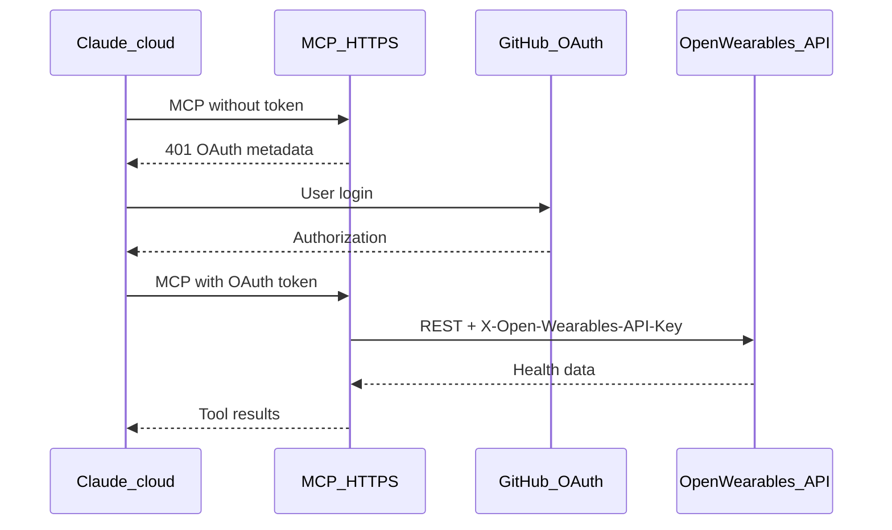

Use a **remote MCP** custom connector so Claude on **mobile**, **claude.ai**, and **Cowork** can query your wearable data. Open Wearables uses **GitHub OAuth** at the MCP edge (required by Claude) and your **`OPEN_WEARABLES_API_KEY`** on the server for API calls.

<Note>
  This is different from **Claude Desktop** local MCP ([stdio setup](/mcp-server/claude-desktop)) and from **Managed Agents** ([vault bearer](/mcp-server/managed-agents-remote)).
</Note>

## Prerequisites

- Public **HTTPS** deployment of Open Wearables **backend** and **MCP** services
- A valid **`OPEN_WEARABLES_API_KEY`**
- A **GitHub OAuth App** you control
- Claude plan that supports custom connectors ([Anthropic docs](https://support.claude.com/en/articles/11175166-get-started-with-custom-connectors-using-remote-mcp))

## 1. Deploy the MCP service

Follow **[Deploy MCP on Railway](/deployment/railway-mcp)** (or your own host) with **Root Directory** `mcp`.

### Environment variables

| Variable | Required | Description |
|----------|----------|-------------|
| `MCP_TRANSPORT` | Yes | `streamable-http` (Docker `start-http` CMD sets this implicitly via entrypoint) |
| `MCP_AUTH_MODE` | Yes | `oauth` |
| `MCP_PUBLIC_BASE_URL` | Yes | Public HTTPS origin, e.g. `https://open-wearables-mcp.up.railway.app` (no trailing slash) |
| `MCP_GITHUB_CLIENT_ID` | Yes | GitHub OAuth App client ID |
| `MCP_GITHUB_CLIENT_SECRET` | Yes | GitHub OAuth App secret |
| `OPEN_WEARABLES_API_URL` | Yes | Public backend base URL |
| `OPEN_WEARABLES_API_KEY` | Yes | API key for tool calls (stays on server) |
| `MCP_JWT_SIGNING_KEY` | Optional | Stable secret so OAuth tokens survive container restarts |

Health check: **`GET /health`** on the MCP public URL.

Your **connector URL** in Claude must be exactly:

```
https://<mcp-public-host>/mcp
```

## 2. Create a GitHub OAuth App

<Steps>
  <Step title="Register the app">
    In [GitHub Developer settings](https://github.com/settings/developers) → **OAuth Apps** → **New OAuth App**.

    - **Homepage URL**: your MCP public URL or project site
    - **Authorization callback URL**:

    ```
    https://<mcp-public-host>/auth/callback
    ```

    Replace `<mcp-public-host>` with the host from `MCP_PUBLIC_BASE_URL`.
  </Step>
  <Step title="Copy credentials">
    Copy **Client ID** and generate a **Client secret** into Railway variables `MCP_GITHUB_CLIENT_ID` and `MCP_GITHUB_CLIENT_SECRET`.
  </Step>
  <Step title="Redeploy">
    Redeploy the MCP service after setting variables.
  </Step>
</Steps>

## 3. Verify the MCP endpoint

```bash
curl -sS https://<mcp-host>/health
curl -sS https://<mcp-host>/.well-known/oauth-protected-resource/mcp
```

Expect health `{"status":"ok"}` and protected-resource JSON with `"resource": "https://<mcp-host>/mcp"`.

Unauthenticated `GET /mcp` should return **401** (Claude uses this for OAuth discovery).

## 4. Add the connector in Claude

| Plan | Where |
|------|--------|
| Pro / Max | [Customize → Connectors](https://claude.ai/customize/connectors) → **Add custom connector** |
| Team / Enterprise | Owner: [Organization settings → Connectors](https://claude.ai/admin-settings/connectors); members connect under Customize |

1. Paste **`https://<mcp-host>/mcp`** as the remote MCP URL.
2. Click **Add**, then **Connect** and sign in with **GitHub** when prompted.
3. In a chat (including **mobile**): **+** → **Connectors** → enable Open Wearables for that conversation.

Test: *"Who can I query health data for?"* — Claude should call `get_users`.

## Architecture



OAuth gates access to **your MCP URL**. Health data scope is determined by the single **`OPEN_WEARABLES_API_KEY`** on the MCP server (single-tenant).

## Firewall

Claude connects from Anthropic's cloud, not your phone. Allow [Anthropic egress IPs](https://platform.claude.com/docs/en/api/ip-addresses) if you use a firewall.

## Troubleshooting

| Symptom | Check |
|---------|--------|
| Connector "couldn't reach" MCP | MCP URL is HTTPS and reachable from the internet; firewall allows Anthropic IPs |
| OAuth fails at GitHub | Callback URL exactly `https://<host>/auth/callback` |
| `Issuer URL must be HTTPS` on boot | `MCP_PUBLIC_BASE_URL` must start with `https://` |
| Tools work in Desktop but not mobile | Mobile needs this **remote** connector, not `claude_desktop_config.json` |
| Empty users / 401 to backend | `OPEN_WEARABLES_API_URL` and `OPEN_WEARABLES_API_KEY` on the **MCP** service |

## Related

- [Deploy MCP on Railway](/deployment/railway-mcp)
- [Claude Desktop (local MCP)](/mcp-server/claude-desktop)
- [Managed Agents (bearer vault)](/mcp-server/managed-agents-remote)
