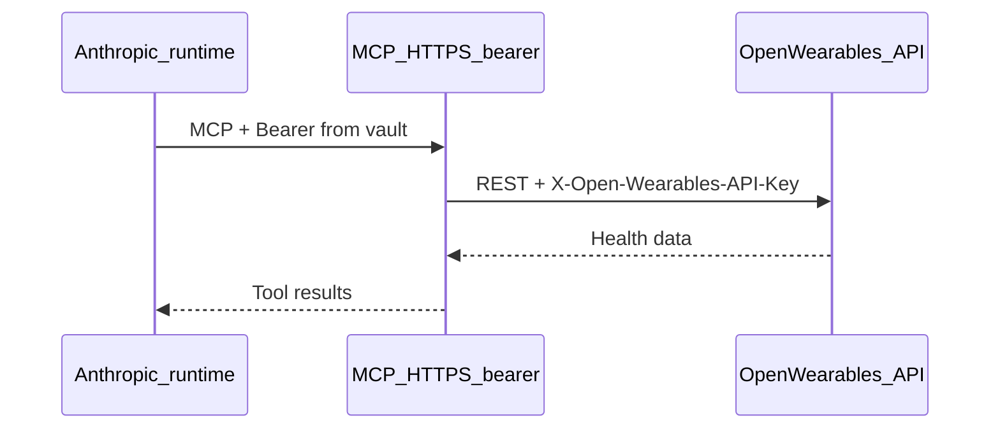

The standard Open Wearables MCP runs over **stdio** (Claude Desktop, Cursor, the Coach service). **Claude Managed Agents** connect to **remote MCP servers** over **HTTPS** using the MCP **streamable HTTP** transport and **vault** credentials.

<Note>
  This is different from the **Claude custom connector** ([OAuth on mobile/web](/mcp-server/claude-custom-connector)) and from **Claude Desktop** ([local stdio](/mcp-server/claude-desktop)).
</Note>

## Prerequisites

- Public **HTTPS** deployment of Open Wearables **backend** and **MCP** services
- A valid **`OPEN_WEARABLES_API_KEY`** on the MCP server
- Anthropic API access with the **`managed-agents-2026-04-01`** beta ([Managed Agents overview](https://platform.claude.com/docs/en/managed-agents/overview))
- A Managed Agents **environment** (`environment_id`) for session creation

## Architecture



- **Public URL**: `https://<your-host>/mcp` (default path **`/mcp`**; configurable via `MCP_HTTP_PATH`).
- **Vault (`static_bearer`)**: Anthropic stores a fixed token keyed by **`mcp_server_url`**. At session runtime it is injected as `Authorization: Bearer …`.
- **Bearer gate**: Token must match **`MCP_BEARER_TOKEN`** on the MCP server (same value as vault **`token`**).
- **Open Wearables API**: MCP calls your backend with **`OPEN_WEARABLES_API_URL`** and **`X-Open-Wearables-API-Key`**. That API key stays **only** on the MCP server; it is **not** the vault secret.

Health probes **`GET /health`** and **`GET /`** respond without a Bearer token so platforms like Railway can health-check the container.

## 1. Deploy the MCP service

Follow **[Deploy MCP on Railway](/deployment/railway-mcp)** with **Root Directory** `mcp`.

Use a **dedicated Railway service** with **`MCP_AUTH_MODE=bearer`**. If you also need the Claude **custom connector**, deploy a **second** MCP service with **`MCP_AUTH_MODE=oauth`** — one container cannot serve both auth modes at once.

### Environment variables

| Variable | Required | Description |
|----------|----------|-------------|
| `MCP_TRANSPORT` | Yes | `streamable-http` (Docker `start-http` CMD) |
| `MCP_AUTH_MODE` | Yes | `bearer` |
| `MCP_BEARER_TOKEN` | Yes | Long random secret; same value as vault `static_bearer.token` |
| `OPEN_WEARABLES_API_URL` | Yes | Public backend base URL (no `/mcp` suffix) |
| `OPEN_WEARABLES_API_KEY` | Yes | API key for tool calls (stays on server) |
| `PORT` | Auto | Railway sets this; server listens on `PORT` when present |

Optional: `MCP_HTTP_PATH`, `USER_LOCAL_TIMEZONE`, `LOG_LEVEL`, `REQUEST_TIMEOUT` — see [Railway MCP deploy](/deployment/railway-mcp).

Your **agent and vault URL** must be exactly:

```
https://<mcp-public-host>/mcp
```

## 2. Verify the MCP endpoint

```bash
curl -sS https://<mcp-host>/health
curl -sS -o /dev/null -w "%{http_code}\n" https://<mcp-host>/mcp
curl -sS -o /dev/null -w "%{http_code}\n" \
  -H "Authorization: Bearer $MCP_BEARER_TOKEN" \
  https://<mcp-host>/mcp
```

Expect health `{"status":"ok"}`, **401** on `/mcp` without Bearer, and a non-401 response with the correct Bearer token.

## 3. Configure Claude Managed Agents

All API calls need:

```bash
-H "x-api-key: $ANTHROPIC_API_KEY"
-H "anthropic-version: 2023-06-01"
-H "anthropic-beta: managed-agents-2026-04-01"
```

Set `MCP_URL` to your exact public MCP URL (example below).

### Create a vault

```bash
vault_id=$(curl --fail-with-body -sS https://api.anthropic.com/v1/vaults \
  -H "x-api-key: $ANTHROPIC_API_KEY" \
  -H "anthropic-version: 2023-06-01" \
  -H "anthropic-beta: managed-agents-2026-04-01" \
  -H "content-type: application/json" \
  -d '{"display_name": "Open Wearables user"}' | jq -r '.id')
```

### Add static_bearer credential

`mcp_server_url` must match the agent URL **character-for-character** (scheme, host, path, trailing slash).

```bash
MCP_URL="https://<mcp-host>/mcp"

curl --fail-with-body -sS "https://api.anthropic.com/v1/vaults/$vault_id/credentials" \
  -H "x-api-key: $ANTHROPIC_API_KEY" \
  -H "anthropic-version: 2023-06-01" \
  -H "anthropic-beta: managed-agents-2026-04-01" \
  -H "content-type: application/json" \
  -d "$(jq -n --arg url "$MCP_URL" --arg token "$MCP_BEARER_TOKEN" '{
    "display_name": "Open Wearables MCP",
    "auth": {
      "type": "static_bearer",
      "mcp_server_url": $url,
      "token": $token
    }
  }')"
```

### Create an agent

```bash
agent_id=$(curl --fail-with-body -sS https://api.anthropic.com/v1/agents \
  -H "x-api-key: $ANTHROPIC_API_KEY" \
  -H "anthropic-version: 2023-06-01" \
  -H "anthropic-beta: managed-agents-2026-04-01" \
  -H "content-type: application/json" \
  -d "$(jq -n --arg url "$MCP_URL" '{
    "name": "Open Wearables Health",
    "model": "claude-opus-4-7",
    "mcp_servers": [
      {"type": "url", "name": "open_wearables", "url": $url}
    ],
    "tools": [
      {"type": "agent_toolset_20260401"},
      {"type": "mcp_toolset", "mcp_server_name": "open_wearables"}
    ]
  }')" | jq -r '.id')
```

### Optional: limit which MCP tools are enabled

By default all tools from the server are enabled. To allow only specific tools:

```json
{
  "type": "mcp_toolset",
  "mcp_server_name": "open_wearables",
  "default_config": { "enabled": false },
  "configs": [
    { "name": "get_users", "enabled": true },
    { "name": "get_sleep_summary", "enabled": true },
    { "name": "get_activity_summary", "enabled": true },
    { "name": "get_workout_events", "enabled": true },
    { "name": "get_timeseries", "enabled": true }
  ]
}
```

Available tool names: `get_users`, `get_activity_summary`, `get_sleep_summary`, `get_workout_events`, `get_timeseries`.

### Create a session

You need an **`environment_id`** from the Managed Agents environments API. Pass **`vault_ids`** so the runtime can authenticate to your MCP.

```bash
session_id=$(curl --fail-with-body -sS https://api.anthropic.com/v1/sessions \
  -H "x-api-key: $ANTHROPIC_API_KEY" \
  -H "anthropic-version: 2023-06-01" \
  -H "anthropic-beta: managed-agents-2026-04-01" \
  -H "content-type: application/json" \
  -d "$(jq -n --arg agent "$agent_id" --arg env "$ENVIRONMENT_ID" --arg vault "$vault_id" '{
    "agent": $agent,
    "environment_id": $env,
    "vault_ids": [$vault]
  }')" | jq -r '.id')
```

Session creation does not validate MCP connectivity upfront. Watch the session event stream for `session.error` with `mcp_authentication_failed_error` or `mcp_connection_failed_error` (see [MCP connector](https://platform.claude.com/docs/en/managed-agents/mcp-connector)).

## 4. End-to-end test plan

Use this checklist after deploy and API setup:

1. **Deploy** MCP with `MCP_AUTH_MODE=bearer`, public `OPEN_WEARABLES_API_URL`, and valid `OPEN_WEARABLES_API_KEY`.
2. **Verify curl** — health OK; `/mcp` 401 without Bearer; non-401 with Bearer (section 2).
3. **Create** vault, `static_bearer` credential (`mcp_server_url` = agent URL), agent, and session with `vault_ids` and `environment_id`.
4. **Run a prompt** in the session, e.g. *"Who can I query health data for?"*
5. **Expect** `get_users` (or equivalent) with no `mcp_authentication_failed_error` in session events.
6. **Confirm** API key scope — users returned match what your `OPEN_WEARABLES_API_KEY` can access.

## Local smoke test (Docker Compose)

The root **`docker-compose.yml`** **`mcp-http`** service sets **`MCP_AUTH_MODE=bearer`**. Add **`MCP_BEARER_TOKEN`** and **`OPEN_WEARABLES_API_KEY`** to `mcp/config/.env`, then:

```bash
docker compose up -d mcp-http
curl -sS http://localhost:8765/health
curl -sS -H "Authorization: Bearer $MCP_BEARER_TOKEN" http://localhost:8765/mcp
```

## Firewall

Managed Agents connect from Anthropic's cloud. Allow [Anthropic egress IPs](https://platform.claude.com/docs/en/api/ip-addresses) if you restrict inbound traffic.

## Troubleshooting

| Symptom | Check |
|---------|--------|
| `mcp_authentication_failed_error` | Vault `mcp_server_url` matches agent `url` exactly; vault `token` = `MCP_BEARER_TOKEN` |
| `mcp_connection_failed_error` | MCP URL is HTTPS and reachable; firewall allows Anthropic IPs |
| Crash on boot "MCP_BEARER_TOKEN required" | Set `MCP_AUTH_MODE=bearer` and uncomment `MCP_BEARER_TOKEN` in env |
| Tools fail / 401 to backend | `OPEN_WEARABLES_API_URL` and `OPEN_WEARABLES_API_KEY` on the **MCP** service |
| MCP tools missing in session | Agent includes `mcp_toolset` with `mcp_server_name` matching `mcp_servers[].name` |
| Session has no MCP auth | `vault_ids` passed at session creation |
| Wrong users returned | `OPEN_WEARABLES_API_KEY` scope (personal vs team) |

## Related

- [Deploy MCP on Railway](/deployment/railway-mcp)
- [Claude custom connector (OAuth)](/mcp-server/claude-custom-connector)
- [Anthropic MCP connector](https://platform.claude.com/docs/en/managed-agents/mcp-connector)
- [Anthropic vaults / static_bearer](https://platform.claude.com/docs/en/managed-agents/vaults)
- [FastMCP HTTP deployment](https://gofastmcp.com/deployment/http)
